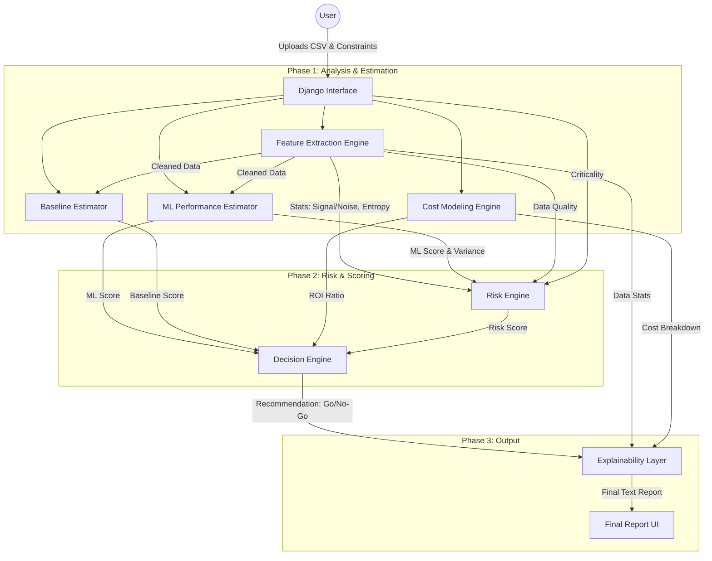

# FeasibilityAI - Technical Documentation

## 1. System Overview

**FeasibilityAI** is a meta-feasibility engine designed to audit the viability of using Machine Learning for a specific problem *before* engineering resources are committed. Unlike traditional AutoML tools which aim to maximize accuracy, this system aims to maximize **Business ROI** by determining if the complexity of AI is justified compared to simpler rule-based approaches.

The system evaluates four key dimensions:
1.  **Data Quality:** Signal-to-noise ratio, missingness, and entropy.
2.  **Performance Lift:** How much better is ML compared to a simple heuristic?
3.  **Cost Viability:** Total Cost of Ownership (TCO) comparison (Dev + Maint + Inference).
4.  **Risk Profile:** Business criticality, model variance, and data stability.

---

## 2. Architecture Flowchart

The following diagram illustrates the data processing pipeline from user upload to final recommendation.

---

## 3. Core Component Breakdown

### A. Feature Extraction Engine (`src/feature_extractor.py`)
**Goal:** Determine if the data contains usable signal.
- **Key Metrics:**
    - `missing_ratio`: Percentage of missing data. High missingness (>20%) flags data risk.
    - `label_entropy`: Checks if the target variable is balanced. Low entropy means the problem might be trivial.
    - `signal_to_noise_est`: Trains a depth-limited Decision Tree (max_depth=3). If this shallow tree cannot find predictive power, the data likely lacks signal, regardless of model complexity.

### B. Baseline Estimator (`src/baseline_models.py`)
**Goal:** Establish the "Floor" of performance.
- Uses `DummyClassifier` (majority class) or `DummyRegressor` (mean).
- **Why?** Identifying if a model is "90% accurate" is meaningless if the majority class is 90% of the data. The "Lift" is calculated as `ML_Score - Baseline_Score`.

### C. ML Performance Estimator (`src/ml_models.py`)
**Goal:** Establish the "Ceiling" of performance.
- Trains lightweight models (Logistic Regression, Gradient Boosting) using 5-fold Cross-Validation.
- **Why Gradient Boosting?** It captures non-linearities and interactions. If an un-tuned GBM cannot beat the baseline, complex Deep Learning likely won't either on tabular data.
- Returns both **Accuracy** and **Variance (Std)** to measure stability.

### D. Cost Model (`src/cost_model.py`)
**Goal:** Quantify the "AI Tax".
- inputs: Developer hourly rates, maintenance hours, inference costs.
- **Formula:**
  $$ \text{Cost Ratio} = \frac{\text{ML Dev Cost} + \text{Training} + \text{Inference (1yr)} + \text{Maint (1yr)}}{\text{Rule Dev Cost} + \text{Rule Maint (1yr)}} $$
- If `Cost Ratio > 1.0`, ML is more expensive. The system demands higher performance lift to justify higher ratios.

### E. Risk Engine (`src/risk_engine.py`)
**Goal:** Calculate a normalized Risk Score (0.0 to 1.0).
- **Factors:**
    - **Data Risk:** Low sample size (<500), high missingness.
    - **Model Risk:** High standard deviation in CV scores (indicates instability).
    - **Business Risk:** User-defined "Criticality". High criticality imposes a strict penalty on black-box solution recommendations.

### F. Decision Engine (`src/decision_engine.py`)
**Goal:** The final arbiter.
The logic is a hierarchical rule set:
1.  **Performance Check:** If `Lift < 5%`, **FAIL** (Use Rules).
2.  **Risk Check:** If `Risk > 0.7`, **WARN** (Use Hybrid).
3.  **Cost Check:** If `Cost Ratio > 5x` AND `Lift < 15%`, **FAIL** (Not worth the money).
4.  **Else:** **PASS** (Use AI).

---

## 4. Data Flow & Files

| Component | File Path | Input | Output |
|-----------|-----------|-------|--------|
| **View (Controller)** | `analyzer/views.py` | CSV File, Form Data | Orchestrates Pipeline |
| **Feature Extractor** | `src/feature_extractor.py` | Pandas DataFrame | Data Dict `{'signal': 0.8, ...}` |
| **Estimators** | `src/ml_models.py` | Pandas DataFrame | Float `0.85`, Std `0.02` |
| **Logic Core** | `src/decision_engine.py` | All Scores | String `"USE AI"`, List of Reasons |
| **Report Gen** | `src/explainability.py` | All Metadata | Formatted Markdown Report |

## 5. Technology Stack

- **Backend:** Python 3.14
- **Framework:** Django 6.0
- **Data Processing:** Pandas, NumPy
- **Machine Learning:** Scikit-Learn (Gradient Boosting, Logistic Regression)
- **Math/Stats:** SciPy (Entropy calculations)
